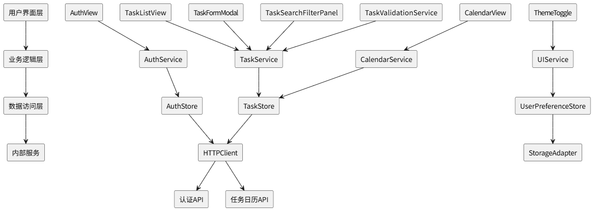

# Todo-Lite 架构设计

## 1 架构图

## 2 简述

Todo-Lite 采用分层架构，将应用划分为四个主要层次，以确保高内聚、低耦合和良好的可维护性。

1. **用户界面层 (UI Layer)**：负责所有用户交互。包含登录、日历、任务列表、表单等视图组件。这些组件不直接处理业务逻辑，而是通过事件与下层通信。
2. **业务逻辑层 (BLL Layer)**：应用的核心，封装了所有业务规则和流程。`AuthService`、`TaskService` 等服务类负责协调数据操作，处理用户认证、任务管理等复杂逻辑，并调用数据访问层。
3. **数据访问层 (DAL Layer)**：作为与数据源交互的统一入口。`AuthStore`、`TaskStore` 等状态管理模块负责管理应用状态。`HTTPClient` 封装了所有网络请求，`StorageAdapter` 负责本地数据的持久化（如使用 `localStorage`）。
4. **内部服务层 (Internal Service Layer)**：包含应用自身的后端服务，如 `认证API` 和 `任务日历API`。数据访问层通过 `HTTPClient` 与这些内部API进行通信，获取或提交数据。

**数据流**：用户在界面层触发操作 → 业务逻辑层处理请求并调用数据访问层 → 数据访问层通过 `HTTPClient` 调用内部API获取数据，或通过 `StorageAdapter` 读写本地存储 → 数据返回，更新状态并刷新界面。
